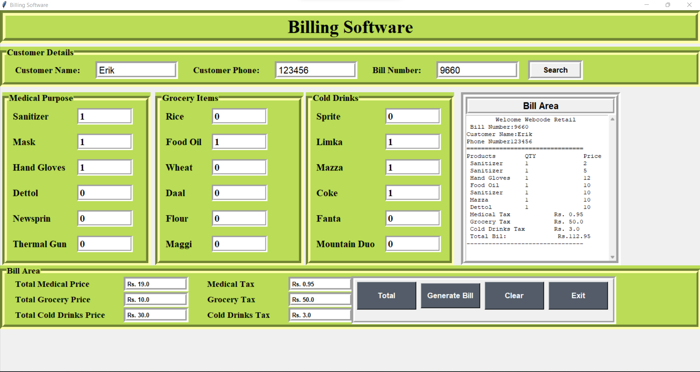

<h1>Billing system using Tkinter module</h1>

This project can be used for any shop. User can store all data and generate a user bill.

<h2>Tech Stack:</h2>
<ul>
    <li>Python</li>
</ul>

<h2>Libraries Used:</h2>
<ul>
    <li>Tkinter</li>
    <li>Os</li>
    <li>Messagebox</li>
</ul>

<h3>To install external modules:</h3>

<li>Run pip install tkinter</li>

<h3>To execute the project:</h3>

<li>Run billing system.py</li>

<h3>Screenshot/GIF of this project.</h3>

